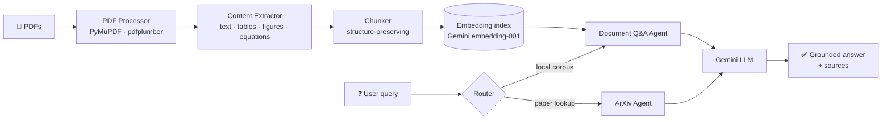

# 📄 AI Document Agent

**Ask questions to your PDFs.** A multi-agent RAG system that ingests research papers and technical documents, extracts text / tables / figures / equations, and answers questions with source-grounded responses — powered by Google Gemini.

[](https://github.com/Harihara04sudhan/ai_document_agent/actions/workflows/ci.yml)
[](https://www.python.org/downloads/)
[](LICENSE)
[](https://github.com/astral-sh/ruff)
[](CONTRIBUTING.md)

```text
❓  "What accuracy and F1-score are reported in the transformer paper?"

🤖  The paper reports 94.2% accuracy and an F1-score of 0.91 on the
    evaluation set (Section 5.2, Table 3).
    Sources: transformer_nlp_paper.pdf · chunk 14, 15
```

## ✨ Why this project?

Most "chat with your PDF" demos stop at naive text splitting. This one doesn't:

- 🧠 **Multi-modal extraction** — pulls text, tables, figure captions, equations, and references out of PDFs (PyMuPDF + pdfplumber), not just raw text
- 🔍 **True semantic retrieval** — Gemini `embedding-001` vectors + cosine similarity over structure-preserving chunks; no separate vector DB to run
- 🤖 **Multi-agent design** — a Document Q&A agent for your local corpus and an ArXiv agent that fetches related papers on demand
- 💬 **Three query modes** — direct lookup, summarization, and metric/result extraction
- 🖥️ **Three interfaces** — CLI, interactive REPL, and a Streamlit web UI
- 🛡️ **Production hygiene** — env-based secrets, caching, rate limiting, structured logging, graceful error handling

## 🚀 Quickstart

```bash
git clone https://github.com/Harihara04sudhan/ai_document_agent.git
cd ai_document_agent
python -m venv .venv && source .venv/bin/activate   # Windows: .venv\Scripts\activate
pip install -r requirements.txt

cp .env.example .env      # then add your GEMINI_API_KEY
```

Get a free Gemini API key at [aistudio.google.com](https://aistudio.google.com/apikey).

```bash
# 1. Drop PDFs into documents/, then build the index
python ingest_documents.py

# 2. Ask away
python main.py --query "Summarize the methodology of the medical AI paper"

# ...or chat interactively
python main.py --interactive

# ...or use the web UI
streamlit run app.py
```

Sample documents are included in `documents/` so you can try it immediately.

## 🏗️ Architecture



| Component | File | Role |
|---|---|---|
| Document Q&A Agent | `agents/document_agent.py` | Retrieval, context assembly, answer generation |
| ArXiv Agent | `agents/arxiv_agent.py` | Live paper search & metadata retrieval |
| PDF Processor | `processors/pdf_processor.py` | Multi-library PDF parsing with fallbacks |
| Content Extractor | `processors/content_extractor.py` | Chunking + embedding index & semantic search |
| LLM Client | `utils/llm_client.py` | Gemini API wrapper with retry/rate-limit |
| Config | `utils/config.py` | Typed, env-driven configuration |

## 🧰 CLI reference

| Command | What it does |
|---|---|
| `python main.py --ingest` | (Re)build the vector index from `documents/` |
| `python main.py --query "..."` | One-shot question |
| `python main.py --interactive` | Chat REPL with conversation context |
| `python main.py --arxiv "..."` | Search ArXiv for papers |
| `python main.py --health` | Check API keys, index, and dependencies |
| `python main.py --stats` | Corpus statistics |
| `python main.py --force-reindex` | Rebuild index from scratch |

## ⚙️ Configuration

Everything is tunable via `.env` (see `.env.example`):

| Variable | Default | Purpose |
|---|---|---|
| `GEMINI_API_KEY` | — | **Required.** Your Gemini API key |
| `GEMINI_MODEL` | `gemini-1.5-flash` | Model used for answers |
| `CHUNK_SIZE` / `CHUNK_OVERLAP` | `800` / `200` | Retrieval granularity |
| `TEMPERATURE` | `0.3` | Answer creativity |
| `MAX_TOKENS` | `2048` | Response length cap |

## 🧪 Tests

```bash
pytest tests/ -v
```

CI runs the suite plus `ruff` lint on every push (see badge above).

## 🗺️ Roadmap

- [ ] OpenAI / Anthropic / local-model (Ollama) providers behind the same `LLMClient` interface
- [ ] Dense embedding retrieval (FAISS) with optional cross-encoder reranking
- [ ] Citation highlighting in the Streamlit UI
- [ ] Docker image + one-command deploy
- [ ] Evaluation harness (RAGAS) with benchmark scores in CI

Want one of these? PRs are very welcome — see [CONTRIBUTING.md](CONTRIBUTING.md).

## 🤝 Contributing

Issues and pull requests are welcome. Read [CONTRIBUTING.md](CONTRIBUTING.md) for setup, style (ruff), and how to propose changes. Good first issues are labeled [`good first issue`](https://github.com/Harihara04sudhan/ai_document_agent/labels/good%20first%20issue).

## 📜 License

[MIT](LICENSE) © Harihara Sudhan R

---

⭐ **If this project helped you, a star helps others find it.**
